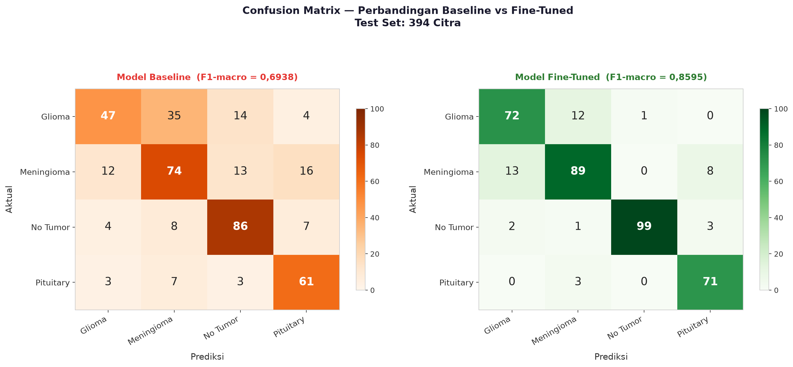
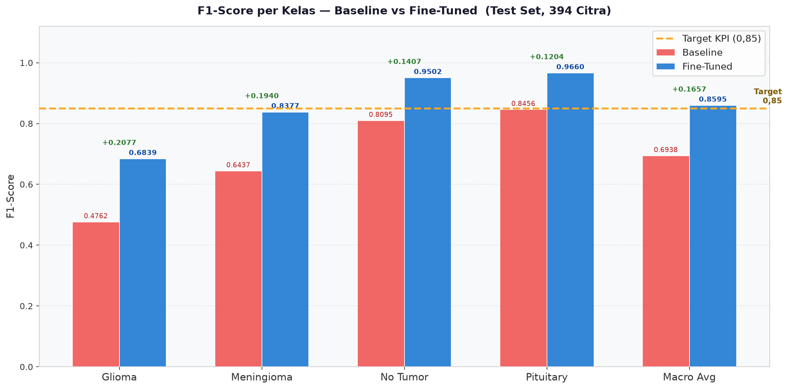
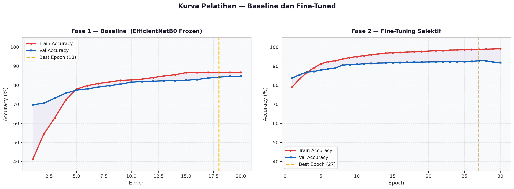
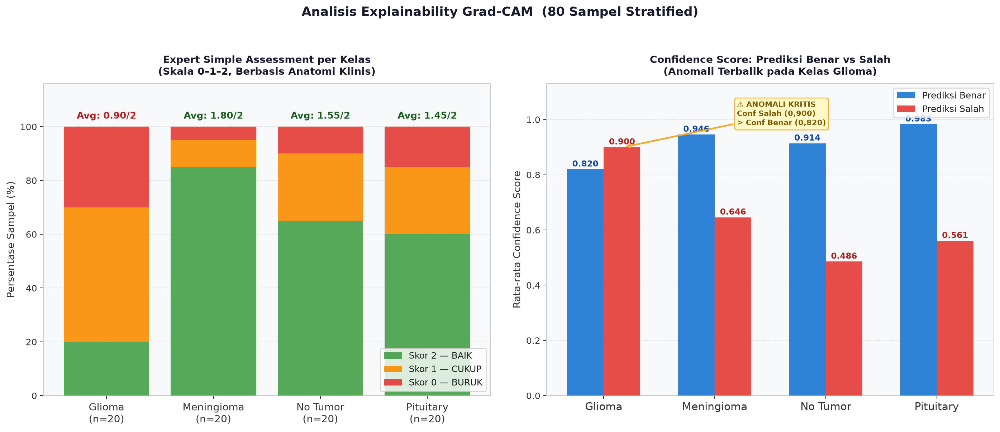

# Brain Tumor Classification & Explainability Analysis using Grad-CAM

> **Laporan Praktik Kerja Lapangan (PKL)**  
> Program Studi Teknik Informatika — Fakultas Teknologi dan Desain  
> Universitas Ma Chung, Malang — 2026

| | |
|---|---|
| **Nama** | Davin Valerian |
| **NIM** | 312310012 |
| **Lokasi PKL** | Laboratorium AiDiTech, Universitas Ma Chung |
| **Pembimbing** | Windra Swastika, S.Kom., MT., Ph.D. |
| **Periode** | 2026 |

---

## Deskripsi Proyek

Repositori ini berisi implementasi lengkap sistem klasifikasi tumor otak berbasis *deep learning* dengan arsitektur **EfficientNetB0** dan analisis *explainability* menggunakan **Grad-CAM** (*Gradient-weighted Class Activation Mapping*), yang dikembangkan selama pelaksanaan PKL di Laboratorium AiDiTech Universitas Ma Chung.

Sistem mengklasifikasikan citra MRI T2-*Weighted* ke dalam **4 kategori**:
- `glioma_tumor`
- `meningioma_tumor`
- `pituitary_tumor`
- `no_tumor`

---

## Hasil Eksperimen

### Performa Klasifikasi

| Model | F1-macro | Accuracy |
|-------|----------|----------|
| Baseline (frozen backbone) | 0.6938 | 0.7028 |
| Fine-Tuned (20 lapisan terakhir) | **0.8595** | **0.8629** |

### Contoh Output Grad-CAM

| Confusion Matrix | F1-Score per Kelas |
|:---:|:---:|
|  |  |

| Kurva Training | Grad-CAM Heatmap |
|:---:|:---:|
|  |  |

---

## Struktur Notebook

File utama: `brain_tumor_gradcam_experiment.ipynb`

| Cell | Konten | Week |
|------|--------|------|
| Cell 00 | Environment Setup & Reproducibility (random seed, GPU config) | Setup |
| Cell 01 | Exploratory Data Analysis — distribusi kelas, visualisasi sampel | Week 2 |
| Cell 02 | Preprocessing Pipeline — Brain Region Cropping + CLAHE | Week 3 |
| Cell 03 | tf.data Pipeline & Class Weights — stratified split, augmentasi | Week 3 |
| Cell 04 | Model Architecture & Baseline Training — EfficientNetB0 frozen | Week 4 |
| Cell 05 | Fine-Tuning EfficientNetB0 — unfreeze 20 lapisan terakhir | Week 5 |
| Cell 06 | Full Model Evaluation — confusion matrix, F1 per kelas | Week 6 |
| Cell 07 | Grad-CAM Implementation — tf.GradientTape manual | Week 7 |
| Cell 08 | Heatmap Generation — 80 sampel stratified (20 per kelas) | Week 8 |
| Cell 08b | Visualisasi Grad-CAM overlay di notebook | Week 8 |
| Cell 09 | Analisis Kualitatif — Expert Simple Assessment per kelas | Week 9 |
| Cell 10 | Analisis Kuantitatif — HCS, FR, AE, SC metrics | Week 10 |
| Cell 11 | Analisis Misprediksi — 3 tipe kegagalan, high-confidence wrong | Week 11 |
| Cell 12 | Eksperimen TTA — Test-Time Augmentation (hasil negatif) | Week 12 |

---

## Dataset

**Brain Tumor Classification (MRI)** oleh Sartaj Bhuvaji

- **Sumber:** https://www.kaggle.com/datasets/sartajbhuvaji/brain-tumor-classification-mri
- **Total:** 3.264 citra MRI T2-Weighted
- **Split:** Training (2.870) / Testing (394)

> ⚠️ Dataset **tidak** disertakan dalam repositori ini karena ukurannya yang besar.  
> Unduh langsung dari Kaggle menggunakan link di atas.

---

## Cara Menjalankan

### Opsi 1 — Jalankan di Kaggle (Direkomendasikan)

Notebook ini dioptimalkan untuk lingkungan **Kaggle dengan GPU T4 x2**.

1. Login ke [kaggle.com](https://kaggle.com)
2. Klik **"+ New Notebook"**
3. Klik **File → Import Notebook** → upload `brain_tumor_gradcam_experiment.ipynb`
4. Tambahkan dataset: **"Add Data"** → cari `brain-tumor-classification-mri`
5. Aktifkan GPU: **Settings → Accelerator → GPU T4 x2**
6. Jalankan semua cell: **Run All**

### Opsi 2 — Jalankan di Lokal

```bash
# 1. Clone repositori
git clone https://github.com/[USERNAME]/brain-tumor-gradcam-pkl.git
cd brain-tumor-gradcam-pkl

# 2. Install dependensi
pip install -r requirements.txt

# 3. Sesuaikan path dataset di Cell 01
# Ubah variabel BASE_DIR di notebook sesuai lokasi dataset Anda

# 4. Jalankan notebook
jupyter notebook brain_tumor_gradcam_experiment.ipynb
```

> ⚠️ Menjalankan di lokal memerlukan GPU dengan minimal **8 GB VRAM** untuk performa optimal.

---

## Teknologi yang Digunakan

| Library | Versi | Kegunaan |
|---------|-------|---------|
| TensorFlow | 2.19.0 | Framework deep learning utama |
| Keras | 3.10.0 | API model (Functional API) |
| OpenCV | 4.9.0 | Preprocessing citra (cropping, CLAHE) |
| NumPy | 1.26.4 | Komputasi matriks |
| Scikit-learn | 1.4.2 | Evaluasi model (classification_report) |
| Matplotlib | 3.8.4 | Visualisasi hasil |
| Seaborn | 0.13.2 | Visualisasi confusion matrix |
| Pandas | 2.2.1 | Tabulasi dan analisis data |

**Lingkungan Komputasi:** Kaggle Notebook — NVIDIA Tesla T4 GPU x2, RAM 30 GB

---

## Fitur Utama

- ✅ **Pipeline Preprocessing Lengkap** — Brain Region Cropping berbasis kontur + CLAHE
- ✅ **Strategi Pelatihan Dua Fase** — Baseline (frozen) + Fine-Tuning selektif 20 lapisan
- ✅ **Implementasi Grad-CAM Manual** — via `tf.GradientTape` tanpa library eksternal
- ✅ **Evaluasi Explainability Ganda** — kualitatif (Expert Simple Assessment) + kuantitatif (HCS, FR, AE, SC)
- ✅ **Analisis Misprediksi** — klasifikasi 3 tipe kegagalan + identifikasi *high-confidence wrong*
- ✅ **Eksperimen TTA** — pengujian Test-Time Augmentation sebagai pembanding

---

## Lisensi

MIT License — lihat file [LICENSE](LICENSE) untuk detail.

---

## Kontak

**Davin Valerian** — Program Studi Teknik Informatika, Universitas Ma Chung  
Laboratorium AiDiTech — di bawah bimbingan Windra Swastika, S.Kom., MT., Ph.D.
